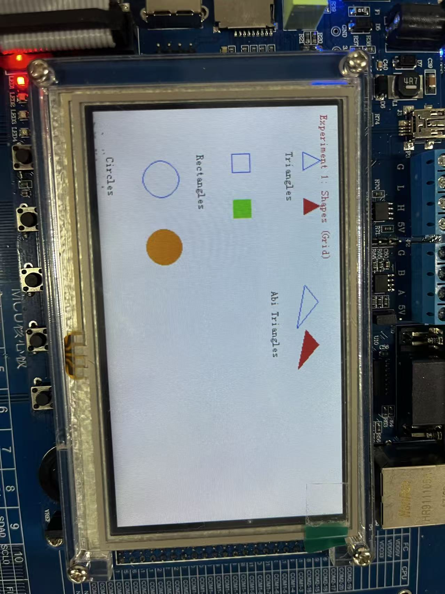

# STM32 微机控制实验库

> 机械系统微机控制课程 BSP 驱动库，提供 LED、UART、ADC、Key、PWM 等外设驱动，方便快速开发实验程序。

---

## � 库结构

```
stm32/
├── BSP/                    # 🔧 驱动库 (Board Support Package)
│   ├── led.h / led.c       # LED 控制驱动
│   ├── uart.h / uart.c     # 串口通信驱动
│   ├── adc.h / adc.c       # ADC 采集驱动
│   ├── key.h / key.c       # 按键输入驱动
│   ├── pwm.h / pwm.c       # PWM 输出驱动
│   ├── lcd.h / lcd.c       # LCD 屏幕驱动
│   ├── motor.h / motor.c   # 直流电机驱动
│   └── delay.h / delay.c   # 延时函数
│
├── exp/                    # 📝 实验示例
│   ├── adc_main.c          # ADC 实验 (电压监测/亮度控制/跑马灯)
│   └── interupt_mian.c     # 中断实验 (定时器/外部中断)
│
├── User/source/main.c      # 当前主程序入口
├── Libraries/              # ST 标准外设库
└── led.uvprojx             # Keil 工程文件
```

---

## � 快速上手

### 1. 使用库编写实验

将 `exp/` 下的示例代码复制到 `User/source/main.c`，或直接参考编写自己的代码：

```c
#include "led.h"
#include "delay.h"
#include "uart.h"
#include "adc.h"
#include "key.h"

int main(void)
{
    // 初始化外设
    Systick_Init();
    LED_GPIO_Init();
    Key_Init();
    ADC_Config();
    
    // 你的实验代码...
    while (1) {
        LED_WriteMask(0x0F);  // 点亮所有 LED
        delay_ms(500);
        LED_AllOff();
        delay_ms(500);
    }
}
```

### 2. 编译烧录

```
1. 打开 led.uvprojx (Keil µVision)
2. 编译: F7
3. 烧录: F8
```

---

## 📚 驱动 API 参考

### LED 驱动 `BSP/led.h`

| 函数 | 说明 |
|------|------|
| `LED_GPIO_Init()` | 初始化 LED GPIO (PC0-PC3) |
| `LED_Set(led, state)` | 设置单个 LED 状态 |
| `LED_WriteMask(mask)` | 掩码写入 (0x01=LED1, 0x0F=全亮) |
| `LED_AllOff()` | 关闭所有 LED |
| `LED_Toggle(led)` | 翻转 LED 状态 |

### UART 驱动 `BSP/uart.h`

| 函数 | 说明 |
|------|------|
| `UART_Init(USARTx, config)` | 初始化串口 |
| `UART_SendString(USARTx, str)` | 发送字符串 |
| `UART_ReceiveChar(USARTx)` | 接收单个字符 |
| `UART_ReceiveAvailable(USARTx)` | 检查是否有数据 |

**配置示例:**
```c
UART_InitTypeDef config = {
    .remap = UART_REMAP_0,      // PA9/PA10
    .baudrate = 115200,
    .wordlength = USART_WordLength_8b,
    .stopbits = USART_StopBits_1,
    .parity = USART_Parity_No,
    .mode = USART_Mode_Tx | USART_Mode_Rx,
    .enableInterrupt = false
};
UART_Init(USART1, &config);
```

### ADC 驱动 `BSP/adc.h`

| 函数 | 说明 |
|------|------|
| `ADC_Config()` | 初始化 ADC |
| `ADC_ReadValue(channel)` | 读取原始值 (0-4095) |
| `ADC_ReadVoltage(channel)` | 读取电压 (0-3.3V) |

### Key 驱动 `BSP/key.h`

| 函数 | 说明 |
|------|------|
| `Key_Init()` / `Key_Init(mode)` | 初始化按键 (GPIO/EXTI 模式) |
| `Key_ReadMask()` | 读取按键状态掩码 |
| `Key_IsPressed(key)` | 检查按键是否按下 |
| `Key_GetEvent(key)` | 获取按键事件 (中断模式) |

### Delay 驱动 `BSP/delay.h`

| 函数 | 说明 |
|------|------|
| `Systick_Init()` | 初始化 SysTick |
| `delay_ms(ms)` | 毫秒延时 |
| `delay_us(us)` | 微秒延时 |

### PWM 驱动 `BSP/pwm.h`

| 函数 | 说明 |
|------|------|
| `PWM_Init()` | 初始化软件 PWM |
| `PWM_SetDutyCycle(duty)` | 设置占空比 (0-100) |
| `PWM_Update()` | 更新 PWM 输出 (需循环调用) |

---

## 📝 实验示例说明

### `exp/adc_main.c` - ADC 综合实验

通过 `#define EXPERIMENT` 切换实验:

| 实验 | 功能 |
|------|------|
| 1 | ADC 电压监测，串口输出 |
| 2 | LED 亮度随电位器变化 |
| 3 | 跑马灯，电位器控速，按键换向 |

### `exp/interrupt_main.c` - 中断实验

通过 `#define ACTIVE_EXPERIMENT` 切换实验:

| 实验 | 功能 |
|------|------|
| `EXPERIMENT_INTERRUPT_TOGGLE` | 按键中断翻转 LED |
| `EXPERIMENT_STOPWATCH_BINARY` | 二进制秒表 |
| `EXPERIMENT_VARIABLE_BLINK` | 可变频率闪烁 |
| `EXPERIMENT_PWM_BRIGHTNESS` | PWM 亮度控制 |
| `EXPERIMENT_BREATHING_LIGHT` | 呼吸灯效果 |

### `User/source/experiment_lcd.c` - LCD & 电机实验



通过 `main.c` 中的 `#define EXPERIMENT` 切换:

| 实验 | 名称 | 功能 |
|---|---|---|
| 1 | **Shapes** | 在 LCD 上绘制三角形、矩形和圆（轮廓及填充） |
| 2 | **Motor** | 电位器控制电机速度，显示运行状态和时间 |

---

## 🔧 硬件引脚

| 功能 | 引脚 | 备注 |
|------|------|------|
| LED1-4 | PC0-PC3 | 输出 |
| UART TX | PA9 / PB6 | 可重映射 |
| UART RX | PA10 / PB7 | 可重映射 |
| ADC | PA1 | 电位器输入 |
| KEY | 见原理图 | S1/S2 |

---

## 📖 开发建议

1. **新实验**: 复制 `exp/` 下的模板到 `main.c`，修改后编译
2. **添加驱动**: 在 `BSP/` 下新增 `.h/.c` 文件，在 Keil 中添加到工程
3. **调试**: 善用 UART 输出调试信息，波特率 115200

---

## ❓ 常见问题

**Q: 编译报错找不到头文件?**  
A: 检查 Keil 工程设置 → C/C++ → Include Paths 是否包含 `BSP` 目录

**Q: LED 不亮?**  
A: 确认调用了 `LED_GPIO_Init()` 初始化

**Q: 串口无输出?**  
A: 检查波特率 115200，TX/RX 交叉连接

---

*祝实验顺利！有问题可参考 `exp/` 下的示例代码。*
